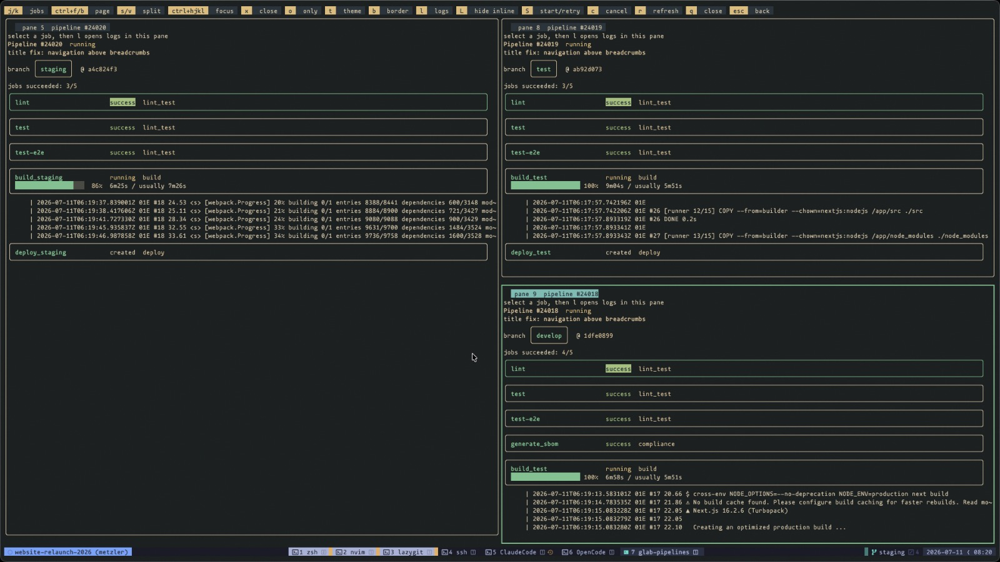

# glab-pipelines

<p align="center">
  
</p>

Interactive terminal UI for viewing and managing GitLab CI pipelines through `glab` and GitHub Actions workflow runs through `gh`.

The provider is detected from the current repository's `origin` remote. You can also select it explicitly with `--gitlab`, `--github`, or `--provider`.

## Prerequisites

- Go 1.22 or newer
- `glab` installed and authenticated for GitLab repositories, or `gh` installed and authenticated for GitHub repositories
- Access to the project or repository you want to inspect

Authenticate the CLI for your provider before running this tool:

```sh
glab auth login  # GitLab
gh auth login    # GitHub
```

## Build

Build the binary from the repository root:

```sh
mkdir -p bin && go build -o bin/glab-pipelines ./cmd/glab-pipelines
```

Or use the Makefile:

```sh
make build
```

## Run

Run directly with Go:

```sh
go run ./cmd/glab-pipelines
```

Run the built binary:

```sh
./bin/glab-pipelines
```

The repository also includes a convenience launcher that rebuilds into your user cache when source files change:

```sh
./glab-pipelines
```

## Usage

```sh
glab-pipelines                 # active pipelines, default
glab-pipelines running         # only running pipelines
glab-pipelines manual          # only manual pipelines
glab-pipelines pending         # any single status
glab-pipelines all             # newest pipelines regardless of status
glab-pipelines -R group/proj active
glab-pipelines --github -R owner/repo all
glab-pipelines --gitlab -R group/project active
```

If you run with `go run`, pass arguments after the package path:

```sh
go run ./cmd/glab-pipelines --github -R owner/repo active
```

For GitHub, `running`, `pending`, `success`, `failed`, `cancelled`, and the native GitHub Actions status/conclusion names are accepted. The default `active` view combines all queued and in-progress states.

## Configuration

Environment variables:

```sh
CI_TUI_PROVIDER=auto       # auto, github, or gitlab
CI_TUI_LIMIT=10            # newest pipelines/runs to show
CI_TUI_REFRESH=20          # pipeline/run detail refresh interval in seconds
CI_TUI_LOG_REFRESH=3       # job log refresh interval in seconds
CI_TUI_THEME=default       # startup color theme override

# Legacy names remain supported for compatibility:
GLAB_TUI_LIMIT=10          # newest pipelines to show
GLAB_TUI_REFRESH=20        # pipeline detail refresh interval in seconds
GLAB_TUI_LOG_REFRESH=3     # job log refresh interval in seconds
GLAB_TUI_THEME=default     # startup color theme override
```

Theme picker selections are saved to `~/.local/share/glab-pipelines/theme`. Active border selections are saved to `~/.local/share/glab-pipelines/border`.

While pipeline/run details or running job logs are being watched, a short ascending cue plays when a job succeeds and a descending cue plays when a job fails. Split panes continue watching independently.

On GitLab, `s` plays or retries a job and `c` cancels that job. On GitHub, `s` reruns the selected completed job (and its dependent jobs), while `c` cancels the selected job's entire workflow run, matching the operations exposed by GitHub Actions. The code viewer shows resolved job scripts on GitLab and the workflow YAML from the run's commit on GitHub.

Themes: `default`, `gruvbox-material`, `tokyo-night`, `catppuccin`, `gruvbox`, `nord`, `dracula`, `kanagawa`, `everforest`, `rose-pine`, `onedark`, `solarized-dark`, `ayu`, `material`, `nightfox`, `sonokai`, `moonfly`, `oceanic-next`, `palenight`, `monokai`, `papercolor`, `edge`.

## Key Bindings

Pipeline list:

- `j`/`k` or arrow keys: move selection
- `enter`: open pipeline details
- `s`: split horizontally
- `v`: split vertically
- `ctrl+h`/`ctrl+j`/`ctrl+k`/`ctrl+l`: focus split left/down/up/right
- `ctrl+n`/`ctrl+p`/`ctrl+f`/`ctrl+b`: scroll down/up/right/left
- `left`/`right`: scroll overflowing pane content horizontally
- `w`: toggle wrapping in the focused pane
- `x`: close focused split
- `o`: close all other splits
- `t`: open theme picker
- `b`: cycle active border style
- `r`: refresh
- `q`: quit
- `Q`: quit app from any screen

Pipeline detail:

- `j`/`k` or arrow keys: move jobs
- `p`: open jobs list
- `s`: split horizontally
- `v`: split vertically
- `ctrl+h`/`ctrl+j`/`ctrl+k`/`ctrl+l`: focus split left/down/up/right
- `ctrl+n`/`ctrl+p`/`ctrl+f`/`ctrl+b`: scroll down/up/right/left
- `left`/`right`: scroll overflowing pane content horizontally
- `w`: toggle wrapping in the focused pane
- `x`: close focused split
- `o`: close all other splits
- `t`: open theme picker
- `b`: cycle active border style
- `S`: start or retry selected job when available
- `c`: cancel selected job when available
- `l`: open logs for the selected job in the focused split
- `C`: open the resolved code for the selected job in the focused split
- `L`: toggle the latest five log lines below running and failed jobs in the focused pane
- `r`: refresh
- `q`: close the focused split, or quit with one pane
- `esc`: go back

Jobs list:

- `j`/`k` or arrow keys: move selection
- `s`: start or retry selected job when available
- `c`: cancel selected job when available
- `l`: open logs
- `C`: open the resolved job code
- `w`: toggle wrapping in the focused pane
- `t`: open theme picker
- `b`: cycle active border style
- `r`: refresh
- `q`: go back

Logs:

- `j`/`k` or arrow keys: scroll
- `pgup`/`pgdn`: page
- `g`: top
- `G`: bottom
- `s`: split horizontally
- `v`: split vertically
- `ctrl+h`/`ctrl+j`/`ctrl+k`/`ctrl+l`: focus split left/down/up/right
- `ctrl+n`/`ctrl+p`/`ctrl+f`/`ctrl+b`: scroll down/up/right/left
- `left`/`right`: scroll overflowing pane content horizontally
- `w`: toggle wrapping in the focused pane
- `#`: toggle line numbers
- `x`: close focused split
- `o`: close all other splits
- `/`: search logs incrementally
- `t`: open theme picker
- `b`: cycle active border style
- `n`: next job, or next search match after confirming search
- `N`: previous search match after confirming search
- `r`: reload
- `q`: close the focused split, or quit with one pane
- `esc`: go back

The code viewer uses the same scrolling, wrapping, line-number, split-pane, and search controls as logs. It shows the resolved `before_script`, `script`, and `after_script` from the selected pipeline's commit.

## Development

Common commands:

```sh
make fmt
make tidy
make test
make build
```

Equivalent Go commands:

```sh
go fmt ./...
go mod tidy
go test ./...
mkdir -p bin && go build -o bin/glab-pipelines ./cmd/glab-pipelines
```

## Repository Layout

```text
cmd/glab-pipelines/   executable application package
go.mod                Go module definition
go.sum                locked module checksums
Makefile              common development commands
glab-pipelines        convenience launcher script
```
